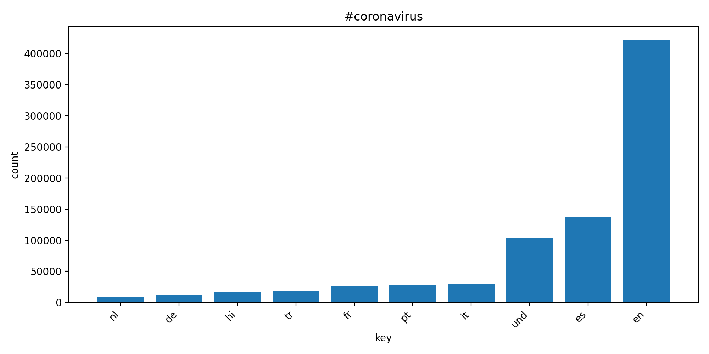
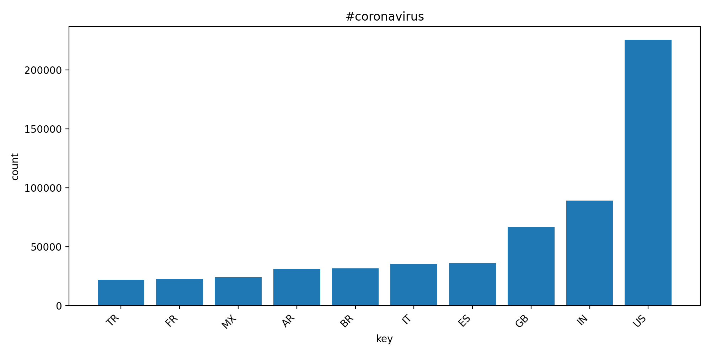
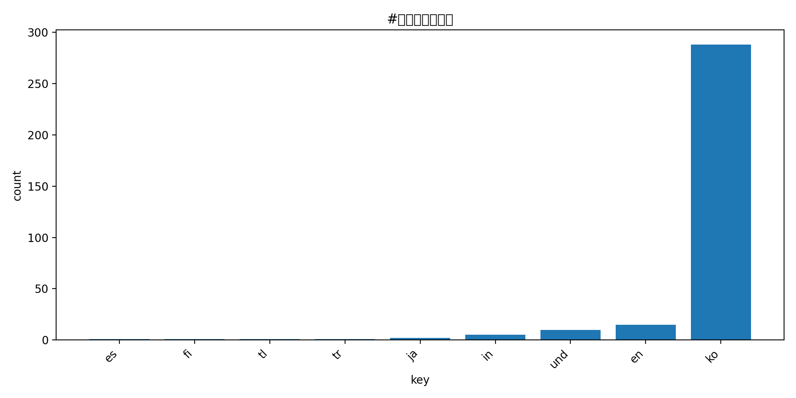
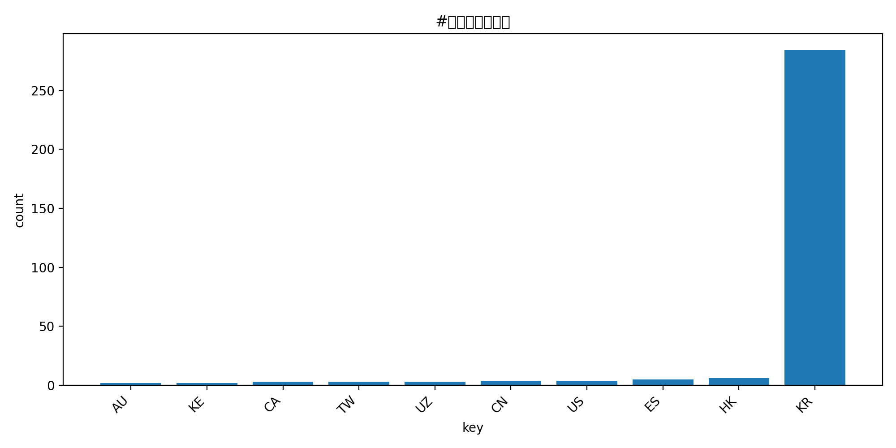
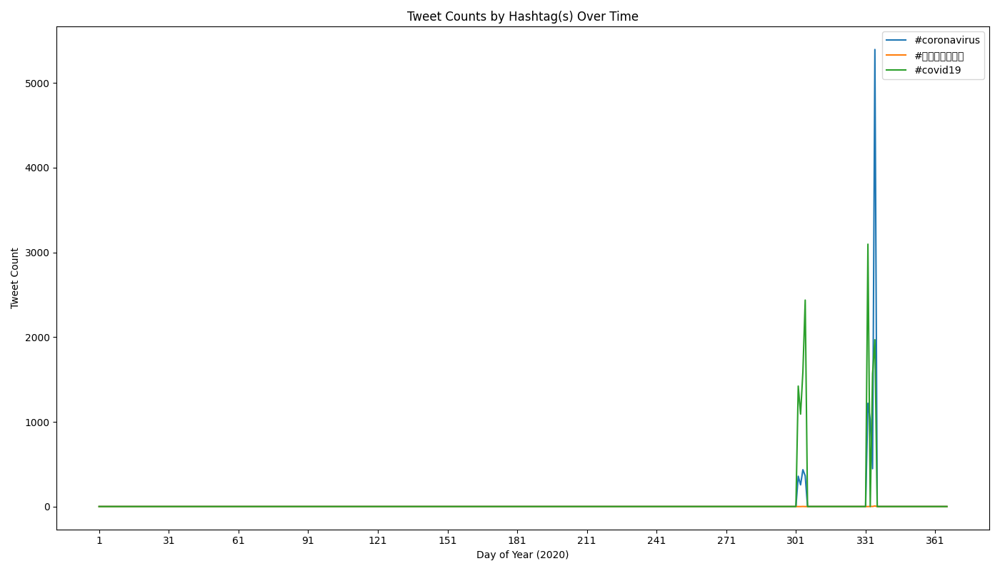

# Coronavirus twitter analysis

This project analyzes the full 2020 geotagged Twitter dataset (~1.1B tweets) to measure how coronavirus-related hashtags spread across languages and countries. I implemented a MapReduce pipeline that processes one day of tweets per mapper, aggregates results across the year with a reducer, and generates visualizations suitable for quick trend inspection.

## Technical Highlights

- Processed ~1.1 billion geotagged tweets from 2020 using a custom MapReduce pipeline.
- Implemented parallel data processing on a distributed dataset by launching daily mappers across the full dataset using POSIX process control (`nohup`, background jobs).
- Streamed compressed tweet archives directly without decompressing to disk to reduce I/O overhead.
- Aggregated hashtag usage across languages and countries using Python-based reducers.
- Generated visualizations showing how COVID-related hashtags evolved globally over time.

## Process overview

### 1) Mapper (`src/map.py`)
For each day’s compressed tweet archive (`geoTwitter20-YY-MM-DD.zip`), the mapper streams JSON tweets and counts:
- total tweets by language (baseline `_all`)
- hashtag usage by language (`.lang` outputs)
- hashtag usage by country code (`.country` outputs)

The mapper writes one output file per day to enable parallel execution across the full year.

### 2) Parallel execution (`run_maps.sh`)
A shell script launches the mapper across all 2020 daily archives using `nohup` + `&` so processing continues after disconnecting and runs in parallel.

### 3) Reducer (`src/reduce.py`)
The reducer performs element-wise addition of daily counters to produce yearly totals:
- `reduced.all.lang.json` (hashtag → language counts)
- `reduced.all.country.json` (hashtag → country counts)

### 4) Visualizations (`src/visualize.py`)
Given a reduced JSON file and a hashtag key, the visualizer generates a bar chart of the **top 10** languages/countries (sorted low→high) and saves it as a PNG.

## Results

### `#coronavirus` — language distribution


### `#coronavirus` — country distribution


### `#코로나바이러스` — language distribution


### `#코로나바이러스` — country distribution


## Hashtag Trends Over Time (Alternative Reduce)

The alternative reduce step aggregates hashtag counts per day across the entire 2020 dataset and visualizes their usage over time. Each line represents a hashtag and shows how frequently it appeared in tweets throughout the year.



## Notes on reliability
- The pipeline runs over the full year of daily archives; each output is derived from mapper outputs and then reduced, avoiding partial-file bias.
- Because the dataset contains only geotagged tweets, counts reflect a consistent subset of Twitter activity rather than all tweets.

## How to reproduce (high level)
1. Run the mapper on daily archives in parallel:
   ```
   $ ./run_maps.sh
   ```
2. Reduce yearly totals:
   ```
   $ python3 src/reduce.py --input_paths src/outputs/*.lang --output_path reduced.all.lang.json
   ```
   > Note: To reduce yearly totals in terms of countries, replace the instances of `.lang` with `.country` in the code above. 
3. Generate plots:
   ```
   $ ./src/visualize.py --input_path=reduced.all.country.json --key='#coronavirus'`
   ```
   > See note above. 
